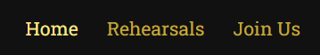
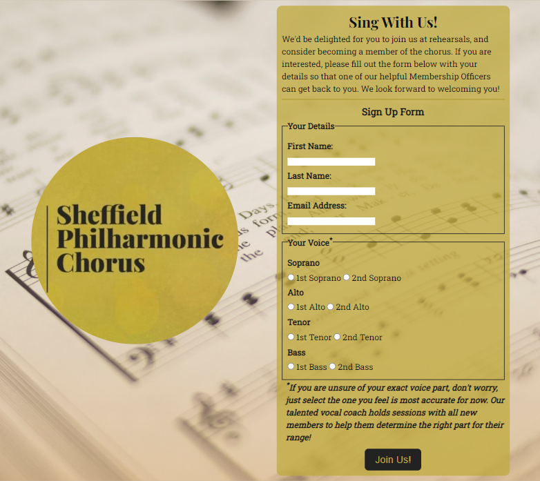

# **The Sheffield Philharmonic Chorus**
## **Site Overview**
The Sheffield Philharmonic Chorus (often abbreviated to 'SPC' in this README.md file) is South Yorkshire's foremost mixed-voice choir, and the purpose of this website is to act as a first stop for people interested in joining. The choir’s ethos is to share its love of a large range of choral music by performing it periodically, and to continue to do this they rely on new members seeking them out and joining them.

Currently, the SPC's official website is vast and full of a wealth of information, but it lacks a clear, streamlined user experience in regards to registering interest to join the choir. This website sets out to meet that need by offering a sign-up form that is clearly sign-posted in multiple areas of the website.

​

## **Table of Contents:**
1. [**Site Overview**](#site-overview)
1. [**Planning stage**](#planning-stage)
    * [***Target Audiences***](#target-audiences)
    * [***User Stories***](#user-stories)
    * [***Site Aims***](#site-aims)
    * [***Colour Scheme***](#colour-scheme)
    * [***Typography***](#typography)
1. [**Current Website Features**](#current-website-features)
    * [***Header***](#header)
        * [*Site Title*](#site-title)
        * [*Navigation Bar*](#navigation-bar)
        * [*Hamburger Menu*](#hamburger-menu)
    * [***Section One***](#section-one)
        * [*Section One Image*](#section-one-image)
        * [*Section One Content*](#section-one-content)
        * [*Section One Call To Action*](#section-one-call-to-action)
    * [***Section Two***](#section-two)
        * [*Section Two Image*](#section-two-image)
        * [*Section Two Content*](#section-two-content)
    * [***Section Three***](#section-three)
        * [*SPC Logo*](#spc-logo)
        * [*Sign-Up Form*](#sign-up-form)
    * [***Form Submission Page***](#form-submission-page)
        * [*Form Submission Confirmation*](#form-submission-confirmation)
        * [*Form Submissions Images*](#form-submission-images)
    * [***Footer***](#footer)
        * [*Footer Links and Disclaimer*](#footer-links-and-disclaimer)
1. [**Testing**](#testing)
1. [**Technologies Used**](#technologies-used)
1. [**Deployment**](#deployment)
1. [**Future-Enhancements**](#future-enhancements)
1. [**Credits**](#credits)
    * [**Honourable Mentions**](#honourable-mentions)
    * [**Code References**](#code-references)
    * [**Content**](#content)
    * [**Media**](#media)

## **Planning stage**
### **Target Audiences**

* Users interested in singing choral music with other like-minded people.
* Users interested in performing choral music as part of a large choir.
* Users who have seen or heard about the Sheffield Philharmonic Chorus and want to find out more.
* Users interested in joining a choir in the Sheffield/South Yorkshire area who do not know about the Sheffield Philharmonic Chorus.

### **User Stories**

* As a user, I want to see the subject matter of the page.
* As a user, I want to navigate the page to find what I require quickly and easily.
* As a user, I want a concise overview about the choir.
* As a user, I want to learn more about when and where the choir rehearses.
* As a user, I want to register to join the choir with ease.

### **Site Aims**

* To provide a concise overview about the Sheffield Philharmonic Chorus.
* To inform the user about when and where the choir meets for rehearsals.
* To offer a straightforward, streamlined experience for users who wish to register with the choir online, by utilising a simple and strong call to action, and an easy to understand online form, rather than users needing to get in touch by email or telephone.
* To maintain the choir's professional reputation whilst demonstrating its friendly and approachable demeanour.

### **Colour Scheme**

For this website I chose an elegant colour scheme comprised of three shades of gold, one shade of antique white and four shades of dark grey. This colour scheme not only matches the Sheffield Philharmonic Chorus' logo, but also works exceptionally well with the images chosen for the website to create an antiquated, refined display.

### **Typography**

* Throughout the page, there are 3 fonts used:
    * Playfair Display
    * Roboto Serif
    * Roboto Slab
​
* The ‘Playfair Display’ font was chosen to match the Sheffield Philharmonic Chorus logo, which is featured in the ‘Join Us’ sections of the site.
* Roboto Slab was chosen as the font for the majority of the body of the site as it maintains readability whilst appearing sophisticated.
* Roboto Serif was chosen for the opening paragraph due to it being better suited to italic styling than Roboto Slab.
* All fonts were sourced from Google Fonts, as stated in the credits.

## **Current Website Features**
### **Header**

The header sits atop the page in a fixed position and a z-index of 1, so that it is always visible for a simple and pleasant user experience. The header height is responsive, and the web page has specific scroll-margin-top styling (or padding for Section One and the Form Submission page) to match this height, so that the Header can remain fixed and visible without obscuring any content.

Within the header, the site title is clearly visible, and there is a navigation bar, which appears in two separate forms depending on the screen size of the user. The contrast between the background colour and text colour is AAA rated, as seen on the above Colour Contrast Grid, and responsive CSS design rules have been applied to the header height, depending on screen size.

Full header at 375px wide:

Full header at 768pc wide: 

Full header at 1280px wide:

#### **Site Title**

The fixed position of the header means that the Site Title is clear and visible - regardless of what device the user is viewing from, and where they are on the website. It starts on the left-hand side of the header, making it intuitive as the website is in English, which is read left-to-right. CSS media queries have been used across multiple breakpoints, so that the text is always appropriately large and easy to read. It is the only h1 element on the website, so that its purpose as the main website title is made obvious not only by its location and styling, but also by its semantic placement within the header for the benefit of assistive technology such as screen readers.

The Site Title also serves as a link to take the user back to the homepage, which is a simple function that users have come to expect on all webpages. There are no special CSS rules applied to the site title (such as the hover rule), to give the illusion that it is an image logo, which is also something users would expect.

#### **Navigation Bar**

The navigation bar is comprised of three unordered list items that are wrapped within a nav element for semantic purposes. Each list item uses an anchor tag to link it to its corresponding section on the website. The three links are 'Home' (Section One), 'Rehearsals' (Section Two) and 'Join Us' (Section Three). These links make it so that the user can navigate to the different sections of the website with ease, and without the need to use the browser's 'back' button. A smooth scroll animation has been applied to the Navigation Links to each section so that the user knows they are being redirected to a section within the same web page they are currently on.

CSS styling rules have been applied for screens that are at least 1050px wide, so that the navigation links appear on the right-hand side of the header, and the links have hover styling that changes the default colour to a brighter shade of gold, so that the user is given interactive confirmation that the text they are hovering over is a clickable link. 

Navigation Bar with 'Home' hovered over (cursor not included in screenshot due to its automatic removal from screenshots):

#### **Hamburger Menu**

On smaller screens, such as tablets and mobile phones, the navigation bar menu appears as a hamburger menu in the top-right corner, which expands when clicked on to reveal the navigation links. The purpose of this is to prioritise the site title, so that users can always see it, and to prevent the header from taking up too much room on smaller screens, providing an optimal experience.

When closed, the hamburger menu displays as three horizontal lines, which users associate with this type of menu:

An animation has been added to the hamburger menu which turns it from the traditional three lines when closed, into a large X when it is open. This makes it feel even more interactive, and to make it clear to users that they can close the menu again by clicking on the familiar transformed shape.

When opened, the hamburger menu displays below the header, and it is responsive to increased header height.

At 375px wide:

At 768px wide:

### **Section One**

Sections One and Two (‘Home’ and ‘Rehearsals’) feature a large image that makes up 50% of the section as a whole. The decision to include images that take up a large part of each section was made in order to make the site more visually eye-catching and appealing, with the additional benefit of not overloading the user with too much text at once.

#### **Section One Image**

Section One’s image was chosen for its eye-catching location and feeling of grandeur, and sets a very professional and serene tone. It also suggests an important level of inclusiveness for those who prefer to wear masks since the outbreak of the Covid-19 pandemic. The image is responsive, and will adapt to the screen size and position without stretching or shrinking.

On smaller screens, the images appear landscape, and are positioned below the content of the section.

Section One image at 550px wide:

On larger screens, the images appear next to the content of the section. Shown next to the content at 1600px wide:

#### **Section One Content**

Section One's main content serves as a welcome to site visitors, and gives a brief history and overview of the choir. The background is an antique white colour, with dark grey text, so that it is clear and easy to read. The opening sentence has different styling to the rest of the text, to make it stand out. It includes a link to Classical Sheffield, of which the SPC is a member, which has been made obvious to the viewer by making the text bold and underlined. When the user hovers over the text, it becomes italicised, indicating it is interactable.

Section One content with 'Classical Sheffield' link hovered over (cursor not included in screenshot due to its automatic removal from screenshots):

#### **Section One Call To Action**

Section One also features a Call To Action box, which has been styled to stand out from the rest of the test by having been given a background colour that matches the font colour in the Header, and styling that matches the form in Section Three of the website. This Call To Action makes it so that users can easily determine one of the primary goals of the website - to invite people to sign up. Through this Call To Action, they can find their way straight to the Sign-Up Form of the website, or to the Rehearsals section if they want to know more about this first.

As with Section One's link to Classical Sheffield, the two links to 'Rehearsals' and 'Sign-Up Form' are made bold and underlined, and the text becomes italicised when hovered over.

### **Section Two**

As with Section One, Section Two is divided into two parts - a large image, and the content. For this section, when viewing on a screen that has a width of at least 1280px, the order of the content and image has switched. This has been done using Flexbox, and means that the section is visually engaging, while avoiding having all text on one side of the website which would look unappealing. 

#### **Section Two Image**

Section Two’s image is more casual by comparison to the image used in Section One, and this is to show the other side of the chorus which is friendly, approachable, and full of smiles. Users of the website will therefore be able to see that the choir is not cold in its professionalism, but also warm and welcoming.

The image is responsive, and will adapt to the screen size and position without stretching or shrinking.

Section Two image at 550px wide:

Shown next to the content at 1600px wide (with the placement being reversed to that of Section One):

#### **Section Two Content**

Section Two provides the user with information about the time, location and frequency of the choir's rehearsals, as well as information about the Music Director, Accompanist and Vocal Coach which any user wishing to sign up can make use of. It uses the same antique white background colour, and same fonts seen in Section One, for consistency and familiarity.

### **Section Three**

Section Three appears visually different from Sections One and Two, again to keep the user visually engaged. It features a fixed background image of a sheet music booklet, which is relevant to the choir's activities, and also subtle enough not to interfere with the foreground. The decision to keep the image in a fixed position was the result of testing the website's responsive design, particularly on mobile.

#### **SPC Logo**

The Sheffield Philharmonic Chorus logo is displayed in Section Three, wrapped in a circular container which makes it stand out from the other images on the website. Its colours are the reverse of the header, which provides the user with a visually pleasing contrast, and helps to establish the brand in the eyes of the users.

On smaller screens, the logo appears at the very bottom of the page, above the footer.

SPC Logo at 375px wide:

On larger screens, the logo appears on the left-hand side of the screen, before the sign-up form. The logo image is responsive, though less so than the other images used on the web page due to its lower maximum resolution. A maximum width has been set so that it does not distort or stretch above the image’s maximum dimensions.

SPC Logo alongside form at 1600px wide:

#### **Sign-Up Form**

Section Three of the site also contains a Sign-Up Form, which is a crucial element to this website as it provides users with a quick, easy way to register to join the choir. To further prevent the background image from interfering with the content, a background colour has been set that matches the Site Title, Navigation Bar and Footer text, and the SPC Logo image background. It has been given a slightly transparent value so that the image is still partially visible.

The form features two fieldsets which clearly define the information that is required from the user. The first fieldset asks for personal details and includes three input fields - two text fields (clearly labelled 'First Name' and 'Last Name') and an email field (clearly labelled 'Email Address') - all three of which are marked as 'required'.

The second fieldset uses radio button input so that the user can select which voice part they would sing in the choir. The first radio button input is marked as required so that one of the eight options must be selected in order to validate the form. Each option is clearly labelled and separated into four separate voice parts, with 1st and 2nd options for each. Some additional text has been included alongside this fieldset, which reassures any users who may not know that the SPC is split into SSAATTBB rather than SATB, and therefore may not be sure which voicepart they sing, that they can just select whichever one they think is closest, and this can be properly determined at a later date.

The 'Submit' button is made distinct from the rest of the form by using the inverse of the form's colours - rather than dark grey text on yellow, the button itself is dark grey with yellow text that is larger than the form's text.

The form is responsive, with the fieldsets and additional text being set to display as columns on smaller screens, and rows on larger screens. This is achieved using Flexbox.

### **Form Submission Page**

The form submission page was created to emulate the experience of submitting a form. In this particular instance, because this website is for education purposes and is not designed to collect data, no form method has been defined. However, in order to create a professional looking website, the form-submission page acts as a confirmation of form validation that the user can understand. It includes the same header and footer as the main site page, so that the user can quickly and easily navigate back to the homepage and other sections at their convenience. For the background, I used the same image of the sheet music book as the one used in Section Three, again for familiarity and thematic suitability.

#### **Form Submission Confirmation**

The Form Submission Confirmation box is a simple text field that utilises the same colour scheme as the Header and Footer. It serves as confirmation to the user that they have correctly filled in the form, and that someone will be in touch with them soon.

#### **Form Submission Images**

As an additional feature to this page, I added four photographs taken from a recent rehearsal to make the page more interesting to the user, and to give the user who has signed up a further idea of the fun they will have singing with the choir. My vision for this section is best displayed at a minimum screen width of 1050px, where all four images form a band across the screen in a way that is reminiscent of photographic film.

This format does not suit smaller screens, however, so I added two levels of responsive design depending on the width of the user's screen - when on a narrow mobile device, the images appear in a column below the box of confirmation text, while on a tablet screen between 550px and 1050px, the photos appear as a 2x2 grid.

### **Footer**

The Footer sits at the bottom of the webpage, with the same colour styling rules as the Header, and its height is consistent across all devices.

#### **Footer Links and Disclaimer**

The four social media links within the Footer are indicated by logos from Font Awesome. As they are logos only, they also include an aria-label so that screen readers can easily understand the purpose of each icon. All links are set to open in a new tab, so that they do not disrupt the user experience. They also have the same hover styling rules as the Navigation Bar, so that users can clearly see that they are interactable.

Full Footer - mobile view:

Full Footer - desktop view:

Footer with the 'Twitter' icon hovered over (cursor not included in screenshot due to its automatic removal from screenshots), displaying the correct linked address at the very bottom of the screen:

A Disclaimer has been added to the very bottom of the Footer, explaining that this website is for educational purposes only.

## **Testing**

A separate file has been created for information about testing. Please click the following link to access it: [**TESTING.md**](TESTING.md) 

## **Technologies Used**

The technologies used in the making of this website are:
* HTML5
* CSS3

## **Deployment**

This website was deployed on GitHub Pages. To do this, the following procedure was followed on desktop:

* Starting at [this project's repository](https://github.com/emmacadavra/ci-portfolio1-spc), navigate to the **'Settings'** tab
* In **'Settings'**, select **'Pages'** from the navigation menu on the left-hand side of the screen
* In **'GitHub Pages'**, find **'Source'** under **'Build and deployment'**
* Select the **'Main'** branch from the drop down menu and click **'Save'**
* A message is then displayed to indicate a successful deployment to GitHub pages, and provides a live link once it has finished fully deploying

The live link to the fully deployed website can be found here: [***https://emmacadavra.github.io/ci-portfolio1-spc/***](https://emmacadavra.github.io/ci-portfolio1-spc/)

## **Future-Enhancements**

As this is my first major project as part of Code Institute's Full Stack Software Development course, I am limited by the current scope of my knowledge.

If I had more time and knowledge, I would see the following enhancements made:

* **JavaScript:** I feel that use of JavaScript would greatly improve the functionality of this website, and allow for even more interactive elements to be included. As I do not know any JavaScript, these things were not possible, but future considerations could be the inclusion of a live Twitter feed, and interactive view of upcoming concerts. Also, where a hamburger menu has been created in CSS for the purpose of this project, I would replace it with an even more intuitive JavaScript hamburger menu.

* **Functional sign-up form:** As mentioned above, for the purposes of this project the sign-up form I have created does not collect any data from users, but ideally a future enhancement would be to create a sign-up form that fulfils its purpose, with a corresponding database set up ready to receive and store the information. This would allow for new membership queries to be handled in the streamlined and modernised way that this website set out to achieve.

* **Additional content:** As mentioned in the credits, a large portion of this site's content was taken from the Sheffield Philharmonic Chorus' website. However, the content used in this project pales in comparison to the rich amount of information and detail given on their official website. Given more time, I would have liked to include more of this information, such as with a page about the SPC's storied history, a dedicated gallery page, and information about the current season of concerts as well as noteworthy concerts of the past.

* **Improved accessibility:** This website utilises viewport height calculations for laptop and desktop screen sizes, which looks slick and appealing to users. However, it is noted in the 'Bugs' section below that while the units of measurement I have used wherever possible are in rem so that increased default font sizes can be taken into account, the viewport height calculations interfere with this level of accessibility. Extra time would be needed to investigate how best to maintain the look of the website (with this viewport height styling rule in mind) whilst also removing barriers for those who use larger font sizes in their browsers.

## **Credits**
### **Honourable Mentions**

I'd like to take this opportunity to express my gratitude to the following people:

* [**Damon Kreft**](https://github.com/damon-kreft) - For your unwavering patience, love and support, and your enthusiasm in seeing me start out on my development journey! Thank you for all of your advice, and for being so proud of me and encouraging me when I have struggled. The breadth of your knowledge and experience has been and will continue to be inspiring to me, and I hope to continue to make you proud!

* [**Richard Wells**](https://github.com/D0nni387) - As my Code Institute mentor, you are always going out of your way to make sure I feel positive about my learning journey by creating a safe and relaxed space to discuss my project. Your feedback is always helpful, and I appreciate your advice and guidance very much.

* [**Kieran Peat**](https://github.com/kieranpeat) - Thank you so much for always being proud of me when I've shared things I've learned or been working on. I'm grateful to you for your encouragement, which means a lot to me. Thank you also for helping me test this website's functionality on Safari!

* [**Christina Webb**](https://github.com/c-webb-sfougaras) - Thank you for encouraging and inspiring me to go after this course as a means to finally take steps into the world of development! I'm looking forward to being able to share our development journeys with each other.

* [**Jake Pike**](https://github.com/iamjakepike) - For being one of my oldest friends, and helping me believe that I have what it takes to become a developer. Thank you also for taking the time to provide me with tips and resources to help me develop my skills, and for providing additional feedback from a business and marketing perspective so that I get a well rounded view of all the things I need to consider!

* [**Michael Fisher**](https://github.com/undefinedyuuki) - Thank you for being so willing to help me refine and polish this website by sharing important lessons you have learned on your web development journey so far. Thank you also for asking all the right questions to help me really consider the best solutions for this project.

* [**The Sheffield Philharmonic Chorus**](https://sheffieldphil.org/) - Thank you, of course, to the Sheffield Philharmonic Chorus, in particular to Anne Adams, the SPC Administrator, for allowing me to use their content in order to progress my skills in software development. I'm proud to be a member of the chorus!

### **Code References**

* As this is my first project as part of [Code Institute's Full Stack Software Development Diploma](https://codeinstitute.net/full-stack-software-development-diploma/), it has been largely influenced by what I have learned up until this point, in particular the 'Love Running' code-along project and the additional learning it inspired me to do (for example, learning Flexbox). I have tried to make this project as unique to me as possible, but there are likely many similarities in the code. Examples of this are the unordered lists used for the header's navigation bar, and social media links in the footer.

* Both the HTML and CSS code for this project's hamburger menu were taken from [Luke Embrey's 10+ Hamburger Menu Examples CSS Only](https://alvarotrigo.com/blog/hamburger-menu-css/) blog post. I have clearly marked where the HTML and CSS code I have used begins and ends using comments in my code. I'm very grateful for this blog post, as it provided me the opportunity to learn something I wouldn't have thought possible with CSS alone.

* My understanding of Flexbox is almost entirely thanks to [Traversy Media's Flexbox Crash Course 2022 YouTube video](https://youtu.be/3YW65K6LcIA), and a follow-up demonstration by [Damon Kreft](https://github.com/damon-kreft) to help me better understand flex-wrap, flex-grow, and flex-basis. Although I wrote the code myself, it is thanks to them that I understood what I needed to do.

* Throughout the project, I often utilised and relied upon [MDN Web Docs](https://developer.mozilla.org/en-US/), [Stack Overflow](https://stackoverflow.com/), [W3Schools](https://www.w3schools.com/) and Code Institute's Programme Content and Slack Channels as references when I was stuck or needed to refresh my knowledge.

* Although I didn't decide to use it in my final commit, at one point during development I used a linear gradient background for the Call To Action in Section One, which was created using [CSSGradient.io](https://cssgradient.io/).

### **Content**

* The large majority of the written content in Sections One and Two of this website has either been taken directly from or based on the content of the [Sheffield Philharmonic Chorus' official website](https://sheffieldphil.org/). _"South Yorkshire's foremost large mixed-voice choir"_ is a direct quote from the SPC website's title and header that I have also used in this website's description and opening paragraph, and I have rearranged (or in some cases reworded or paraphrased) the select few sentences I chose to include in this website. I am once again very grateful to have been given permission to use this content for the purposes of this project.

* All icons used are from [Font Awesome](https://fontawesome.com/).

* All fonts have been imported from [Google Fonts](https://fonts.google.com/).

### **Media**

* The photograph used in Section One of this website - which I named [choir-orchestra-church.jpg](https://unsplash.com/photos/yUJVHiYZCGQ) - is by [Andrea Zanenga on unsplash.com](https://unsplash.com/@andreazanenga).

* The photographs of the Sheffield Philharmonic Chorus rehearsing, used in Section Two and on the Form Submission page - 'choir-rehearsing.jpg', 'rehearsal1.jpg', 'rehearsal2.jpg', 'rehearsal3.jpg' and 'rehearsal4.jpg' - are real photographs of the choir and were shared with me by Anne Adams, the SPC Administrator, along with permission to use them. All rights belong to the choir.

* The Sheffield Philharmonic Chorus logo used in Section Three was taken - with permission - from the [Sheffield Philharmonic Chorus Twitter Account](https://twitter.com/SheffPhilChorus).

* The background image of a sheet music book - which I named [sheet-music-book.jpg](https://unsplash.com/photos/bu-6kNWQj6U) - is by [Michael Maasen on unsplash.com](https://unsplash.com/@mgmaasen).

* The screenshot under the Site Overview section of this README.md, displaying the website at different breakpoints/on different devices, was made on [Am I Responsive](https://ui.dev/amiresponsive).

* The [Colour Contrast Grid](https://contrast-grid.eightshapes.com/?version=1.1.0&background-colors=&foreground-colors=%23111%2C%0D%0A%23222%2C%0D%0A%23333%2C%0D%0A%23444%2C%0D%0A%23b6a139%2C%0D%0A%23c0aa3c%2C%0D%0A%23faebd7%2C%0D%0A&es-color-form__tile-size=compact&es-color-form__show-contrast=aaa&es-color-form__show-contrast=aa&es-color-form__show-contrast=aa18&es-color-form__show-contrast=dnp) used in the Colour Scheme section of this README.md is courtesy of [Eightshapes](https://eightshapes.com/).