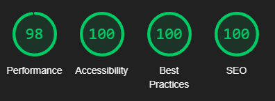

# **The Sheffield Philharmonic Chorus - Testing**

## **Table of Contents (Testing):**
1. [**Testing Throughout Development**](#testing-throughout-development)
    * [***Overview***](#overview)
    * [***Responsive Design and Functionality***](#responsive-design-and-functionality)
    * [***Testing of Site Features***](#testing-of-site-features)
        * [*Header Links - Navigation Bar and Hamburger Menu*](#header-links---navigation-bar-and-hamburger-menu)
        * [*Links in Section Content*](#links-in-section-content)
        * [*Sign-Up Form Input Fields*](#sign-up-form-input-fields)
        * [*Footer Links*](#footer-links)
    * [***Bugs***](#bugs)
    * [***Validation Issues***](#validation-issues)
        * [*W3C HTML Error*](#w3c-html-error)
        * [*Lighthouse and PageSpeed Insights Issues*](#lighthouse-and-pagespeed-insights-issues)
    * [***Accessibility***](#accessibility)
1. [**Testing Post-Development**](#testing-post-development)
    * [***Validation***](#validation)
        * [*HTML Validation*](#html-validation)
        * [*CSS Validation*](#css-validation)
        * [*Lighthouse Scores and PageSpeed Insights*](#lighthouse-scores-and-pagespeed-insights)
    * [***Unresolved Bugs***](#unresolved-bugs)
        * [*PageSpeed Insights Performance Scores on Mobile*](#pagespeed-insights-performance-scores-on-mobile)
        * [*Viewport Height Issue on Safari*](#viewport-height-issue-on-safari)
        * [*WAVE Web Access Accessibility Evaluation Error*](#wave-web-access-accessibility-evaluation-error)

## **Testing Throughout Development**

### **Overview**

During development, I manually tested the website as I went along by using the 'python3 -m http.server' command in GitPod's VSCode workspace. This created a live version of the website, and every time I saved my work on GitPod I could refresh the page to see whether my code was working as intended. Google Chrome is my default browser, so I was predominantly using Chrome's DevTools to allow me to test the content across different screen sizes, as well as using it as a first point of call for bug fixes, as it enabled me to tweak the code, disable certain elements and add to them without directly impacting the website itself. 

At various stages throughout development, before deploying the website to GitHub Pages, I made the server I was working on public so that I could test it on other devices such as my mobile phone. I would also share it with certain people to see how certain things looked on their devices, asking them to confirm that the site was functional and/or visually appealing so that I could get an idea of how the website performed across a variety of devices.

Once I was happy with the overall design of the website, I deployed it to GitHub Pages so that I could share the link with more people, and begin making necessary tweaks and debugging more efficiently.

### **Responsive Design and Functionality**

The site's functionality has been tested and confirmed as fully responsive across different breakpoints on the following browsers for both desktop and mobile:

* Google Chrome
* Mozilla Firefox
* Microsoft Edge
* Opera
* Safari

It has also been tested across different browsers on a variety of virtual operating systems such as Mac, iOS, Android and Windows through the use of [**BrowserStack**](https://www.browserstack.com/live).

This website heavily relies on Flexbox, which I tested on the above mentioned browsers and virtual devices by dynamically changing and shifting the dimensions of the browser to mimic a variety of mobile, tablet and laptop/desktop screen sizes. By dynamically changing the dimensions of the webpage, I was able to test that elements with Flexbox properties were behaving in the way I envisioned them to, for example making sure that there were no instances on form-submission.html where the rehearsal-photos would appear as three images in one row with one in a row beneath it due to flex-wrap, and instead that they followed the rules I had set them to either appear as four in a row, in a two-by-two grid, or in a single column.

I also tested the website on my own personal mobile phone, and asked friends and family to open it on their mobile phones which included the iPhone 11, Samsung Galaxy S10, Huawei P30 Pro, and Xiaomi Poco X3, so that I could get a broader view of how the website displays and responds across different screens. 

### **Testing of Site Features**

When testing the website across the different browsers, I made sure to test not only that there was consistency in the website's overall design and layout, and that the page elements reacted appropriately without causing any breaks in the design, but also that every element that can be interacted with was working as intended.

#### **Header Links - Navigation Bar and Hamburger Menu**

The Site Title links to index.html, so I tested this on all browsers by clicking it to make sure the page refreshed, and that no text-decoration appeared on the link itself. Similarly, I tested the links in the Navigation Bar to make sure the hover styling was working, that the links navigated to the correct section, with the smooth scroll animation and the correct scroll-margin-top value so that the Header doesn't obscure any of the section content. I performed these tests on index.html and form-submission.html to ensure they both worked identically for a smooth user experience.

When testing the functionality of the Hamburger Menu, I used different devices to check that the animation was consistent, and that the menu sat just below the Header/Site Title for a pleasing user interface. The screenshots in the [**README.md file**](README.md) were taken in Google Chrome.

Below are screenshots of the menu on Safari at 768px wide and iOS on the iPhone 11:

#### **Links in Section Content**

As with the Navigation Bar links, I tested the links within Section One's content to ensure they navigated to the correct location. I tested the 'Classical Sheffield' link in Section One by clicking it to make sure it opened in a new tab so as not to interrupt the user experience. I also tested the links in Section One's Call To Action by clicking them to make sure they navigated to the correct area of the page, in the same way that the Navigation Bar links do. I also tested to make sure the hover effect was applied when using a device with a cursor.

#### **Sign-Up Form Input Fields**

Testing the functionality of the Sign-Up Form across all devices and browsers was crucial due to its high level of importance in reaching the website's goals.

I tested each input field individually by attempting to submit the form without entering anything into the fields one by one. This was to ensure that the form cannot be submitted without filling in the required inputs, and also to ensure that the user is given an appropriate error when nothing is entered. For example, the 'First Name' and 'Last Name' inputs are text fields so that any text can be entered, but they are required so users cannot accidentally submit the form without including their name.

The input field for 'Email Address' is an email input field, which is not only required but also will not let the user accidentally submit something that is not in an email address format.

I tested the radio buttons used for the Voice Part section of the Sign-Up Form. I set only the first radio input as required so that the form knows to only accept one of the eight options, so I first tested that the form could not be submitted without selecting one, and then I tested to make sure that only one could be selected at a time. I made sure to test each of the radio button selections when submitting the form to ensure they were all functional.

Finally, I tested the 'Submit' button by clicking/pressing it to make sure it navigates the user to the Form Submission Confirmation page!

Overall, my testing found that the Sign-Up Form is intuitive and easy for the user to interact with and complete by providing them with clear labels and input types that prevent the form from being submitted incorrectly.

#### **Footer Links**

I tested the Footer's social media links in the same way I tested the Header's Navigation Bar/Hamburger Menu links and the links in Section One.

### **Bugs**

(Bugs, including border-box sizing, burger menu clickable area being tiny, max-width 1050px burger menu issue, horizontal scroll on form-submission, grey bottom of section-three, page not found due to incorrect file paths on form-submission page, w3c issue with hamburger html, etc)

### **Validation Issues**

During the development process, I came across some validation issues with both my HTML and Lighthouse/PageSpeed Insight scores.

#### **W3C HTML Error**

This website utilises code from [Luke Embrey's 10+ Hamburger Menu Examples CSS Only](https://alvarotrigo.com/blog/hamburger-menu-css/), as detailed in the **'Credits'** section of the [**README.md file**](README.md). In the original HTML code that I used, a div element was placed inside a label element, like so:

When running my HTML through the [**W3C Markup Validation Service**](https://validator.w3.org/), I was met with the following error:

I was able to rectify this by replacing the div element with a span element, as in this context it was important for the child element of the label to be an in-line element, not a block element.

#### **Lighthouse and PageSpeed Insights Issues**

A major issue I came up against quite late in development was that the website was performing poorly on Lighthouse and PageSpeed Insights when it was run through their mobile tests.

The Lighthouse scores for index.html and form-submission.html were coming back as between 70 and 85, and the PageSpeed Insights scores were coming back much lower, sometimes even below 60.

When looking into the results, it was clear that the main reason for these particularly low scores was that the images used on both pages were very high resolution, and as such taking much longer than necessary to load. The first step I took to improve this was to compress the images through [**Optimizilla**](https://imagecompressor.com/), but this did not make a significant enough change. I then realised that one of the images I was using - 'choir-rehearsing.jpg' - had the enormous dimensions of 5,312 x 2,988px, so I resized the image to match the dimensions of 'choir-orchestra-church.jpg'. I also resized all four images of the choir used on form-submission.html to be smaller, and compressed those as well.

While this did have a positive impact on the Lighthouse and PageSpeed Insights desktop scores, and the form-submission.html mobile score, it still did not do enough to significantly improve the index.html mobile score. It was at that point that I uploaded a smaller resized version of the images - 'choir-rehearsing-mobile.jpg' and 'choir-orchestra-church-mobile.jpg' - and introduced a picture element containing srcset HTML rules. This increased the mobile scores greatly, as the browser was no longer having to spend so much time loading a much higher resolution image than it would ever need on smaller devices.

### **Accessibility**

Both during development and post-development, I ran additional tests on this website to make sure that it had high levels of accessibility.

In addition to the Lighthouse and PageSpeed Insight Accessibility tests, I ran this website through the [**WAVE Web Accessibility Evaluation Tool**](https://wave.webaim.org/). Both index.html and form-submission.html returned one error, which I have detailed in the **'Unresolved Bugs'** section of this document, but passed in all other areas.

Initially, I had also set most of the heights, widths and dimensions within the website in pixel values. However, when discussing this with my mentor and other developers mentioned in the **'Honourable Mentions'** section of the [**README.md file**](README.md), I learned that it was best practice to use rem measurements. This contributes to good practise in accessibility considerations, as it means that if a user who is partially sighted increases the default text size of their browser, the website scales appropriately and removes any barriers they might otherwise have if the font sizes were fixed by pixels.

Following on from this, I had set rules for the height of each page section, so that it would always appear as 100vh minus the height of the header (and footer in the case of Section Three and the Form Submission page). The reason I did this was to create the effect of each section appearing as though it was a separate page when on desktop, to clearly separate the sections in the mind of the user. However, when testing the website's responsiveness to the increased default font-size accessibility tool in Google Chrome, I realised that the fixed viewport height became another barrier to people who need to use this tool. I therefore amended the desktop viewport height rules to be min-height rules, to allow the page to expand to fit the content when larger font-sizes are applied.

## **Testing Post-Development**

### **Validation**

In order to validate this website in terms of its HTML code, CSS code, and general overall quality, I used the [**W3C Markup Validation Service**](https://validator.w3.org/), [**W3C CSS Validation Service ('Jigsaw')**](https://jigsaw.w3.org/css-validator/), [**Google Chrome Lighthouse Tool**](https://chrome.google.com/webstore/detail/lighthouse/blipmdconlkpinefehnmjammfjpmpbjk?hl=en) and [**PageSpeed Insights**](https://pagespeed.web.dev/).

#### **HTML Validation**

The HTML for both index.html and form-submission.html was entered into the [**W3C Markup Validation Service**](https://validator.w3.org/), and both pages passed with no errors being detected.

#### **CSS Validation**

The CSS code for this website was entered into the [**W3C CSS Validation Service ('Jigsaw')**](https://jigsaw.w3.org/css-validator/), and passed with no errors found.

#### **Lighthouse Scores and PageSpeed Insights**

When using Lighthouse, I made sure that tests were run in Incognito windows so that there could be no interference from browser extensions.

Below are screenshots of the final, post-development results for both the mobile and desktop Lighthouse tests for index.html and form-submission.html. They were very consistent across multiple browsers and devices, with some tests coming back with perfect 100 scored in all categories, however these screenshots are ones I've taken from my own PC:

Desktop Lighthouse test - index.html:

Desktop Lighthouse test - form-submission.html:

Mobile Lighthouse test - index.html:

Mobile Lighthouse test - form-submission.html:

Below are screenshots of the final, post-development results for both the mobile and desktop PageSpeed Insights tests for index.html and form-submission.html. The desktop scores were consistent across multiple browsers and devices, but the mobile versions fluctuated fairly significantly, which I mention in the **'Unresolved Bugs'** section below these screenshots:

Desktop PageSpeed Insights test - index.html:

Desktop PageSpeed Insights test - form-submission.html:

Mobile PageSpeed Insights test - index.html:

Mobile PageSpeed Insights test - form-submission.html:

### **Unresolved Bugs**

There are three noteworthy things about this website that I would consider unresolved bugs:

#### **PageSpeed Insights Performance Scores on Mobile**

The biggest and most important unresolved bug is that, when testing the mobile versions of index.html and form-submission.html on PageSpeed Insights, the Performance score often fluctuates. As mentioned in the **'Validation Issues'** section under **'Bugs'**, initially I found that the website scored much lower than desired in its Performance scores due to the high resolutions of the images used on the website (particularly for index.html), and a lack of explicit image widths and heights due to the responsive design model. I was able to improve this score by compressing the images as well as introducing a srcset rule to the HTML, so that the browser would load a lower resolution version of the image for screens under 1280px wide.

While this was enough to significantly raise the Performance score on Lighthouse to above 90, it was not enough to see the same consistency in PageSpeed Insights. As shown above in the final screenshots, the average high score I could get is 88, however the tests would vary, with one tester seeing average scores of around 85, but even in my own testing I sometimes received scores of 70 - 80. I do believe that a potential solution for this would be to resize the images again and add an additional srcset rule for small mobile screens, however I did find that a consistent issue I came across was due to the efficiency of GitHub's cache policy - which is beyond my control. Regardless, this is something I will keep in mind for the future, as well as learning how to use programs like GIMP that would allow me to resize, compress, and save images in next-gen formats such as WEBP.

#### **Viewport Height Issue on Safari**

As mentioned previously in this document, I tested this website across multiple browsers and devices, across a variety of breakpoints. One consistent issue I came across was that Safari does not recognose viewport height CSS rules in the same way as other browsers, and so Section One and Section Two were elongated past the normal points, as seen in the screenshots below:

After investigating this, it seems that this is a known issue that is usually fixed using JavaScript, which is outside of the current scope of my knowledge and something I would like to implement in the future. 

#### **WAVE Web Access Accessibility Evaluation Error**

When passing index.html and form-submission.html through the [**WAVE Web Accessibility Evaluation Tool**](https://wave.webaim.org/), one error appeared for both pages:

The empty label that it refers to is part of the HTML code I used for the hamburger menu, and from what I understand it needs to remain blank. This obviously is not ideal and I would have liked to have caught this earlier in the development cycle so that I could learn how to negate this negative impact on the website's accessibility.